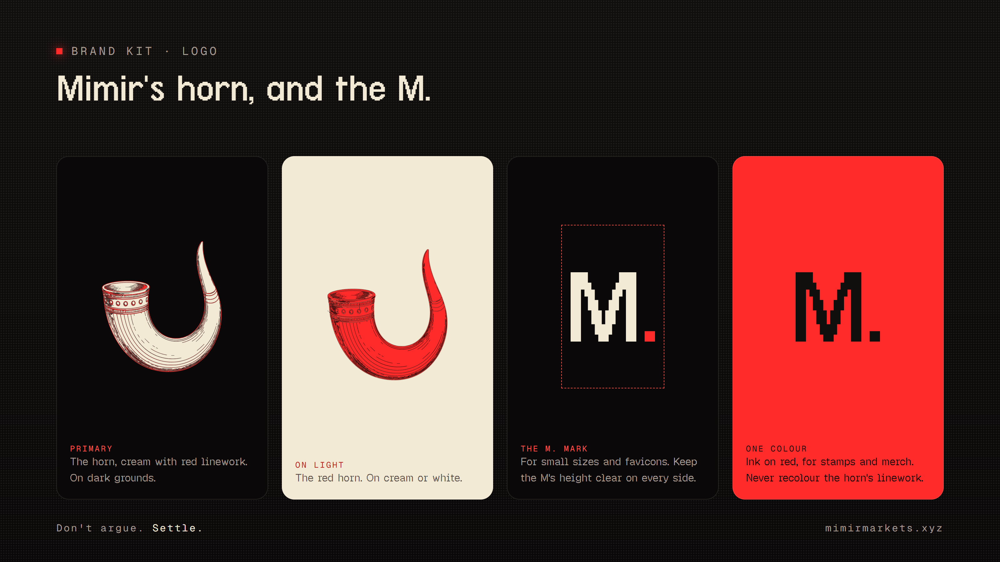
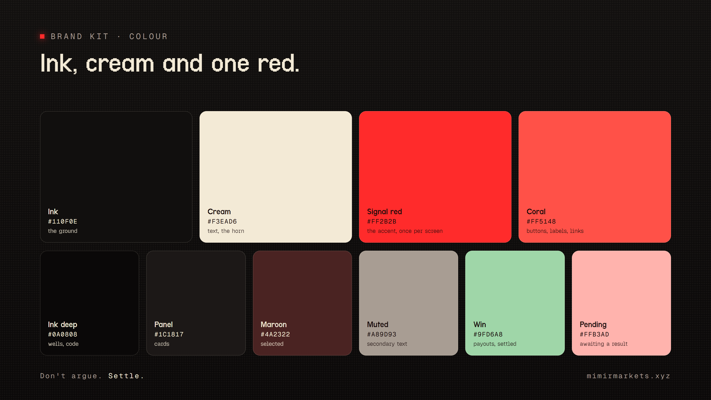
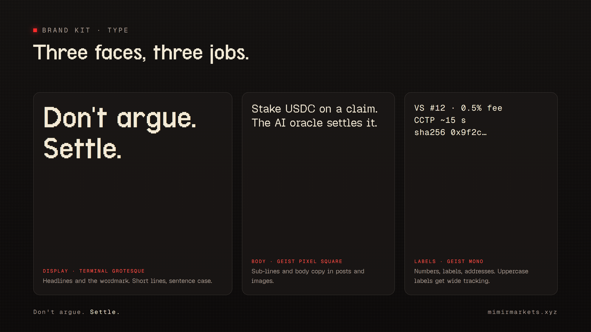

# Mimir brand kit

Everything here renders from plain HTML in `source/` with the site's own tokens (`app/globals.css`). Videos,
their projects and post images are made locally and are not tracked (see `.gitignore`); this folder keeps the
identity: the logo, the X profile and banner, and the kit sheets.





## Logo

| File | Use |
|---|---|
| `logo/mimir-horn.svg`, `kit/logo/mimir-horn.png` | **Primary.** Mimir's horn, cream with red linework, on dark grounds. |
| `logo/mimir-horn-red.svg`, `kit/logo/mimir-horn-red.png` | The horn in red, on cream or white. |
| `logo/mimir-horn-tile.svg` | The cream horn on a rounded ink square (app icons, avatars). |
| `logo/mimir-mark.svg`, `kit/logo/mimir-mark.png` | The M. mark: cream M, red period. Small sizes, favicons. |
| `logo/mimir-mark-mono.svg` | The M. mark in one colour (`currentColor`). |
| `kit/logo/mimir-mark-ink.png` | The M. mark in ink, for red or cream grounds, stamps and merch. |
| `logo/mimir-mark-tile.svg` | The M. mark on a rounded ink square, 1024×1024. |
| `x-profile.png`, `x-banner.png` | X avatar (800×800, circle-safe) and header (3000×1000). |

PNGs in `kit/logo/` are 1024×1024 with a transparent background. The SVG horn is ~300 KB: use the PNGs below
~256 px.

Rules:
- Keep clear space of at least the M's height around the mark, and a quarter of the horn's width around the horn.
- The horn keeps its own colours: cream with red linework, or red with coral linework. Do not recolour, outline,
  rotate, stretch or add effects.
- One logo per image. Never place the horn on a busy photo; use ink, cream or signal red grounds.
- The wordmark is the word "Mimir" set in the display face, never redrawn.

## Colour

| Token | Hex | Use |
|---|---|---|
| Ink | `#110F0E` | the ground of almost everything |
| Cream | `#F3EAD6` | text, the horn |
| Signal red | `#FF2B2B` | the accent: one use per screen or image |
| Coral | `#FF5148` | buttons, labels, links |
| Ink deep | `#0A0808` | wells, code, inset boxes |
| Panel | `#1C1817` | cards |
| Maroon | `#4A2322` | selected states |
| Muted | `#A89D93` | secondary text |
| Win | `#9FD6A8` | payouts, settled, positive results |
| Pending | `#FFB3AD` | waiting on a result |

Ink and cream carry the page; red marks the one thing to look at. Green is only for money that was won.

## Type

| Role | Face | Where |
|---|---|---|
| Display | Terminal Grotesque | headlines and the wordmark; short lines, sentence case |
| Body | Geist Pixel Square | sub-lines and body copy in posts and images |
| Labels | Geist Mono | numbers, labels, addresses; uppercase labels get wide tracking |

Licences are in `source/fonts/`.

## Imagery

- The 4 px dot screen and the ASCII wave field (`source/parts.js`, the landing hero's own field) are the
  backgrounds. A red glow sits behind the subject, never behind text.
- The pixel scribble under a word marks the one phrase that matters ("Settle.").
- Diagrams use dashed red flow lines, ink boxes with a hairline border, and one red-outlined box for the focus.
- Partner logos (Arc, Solana, Circle) come from their own brand kits, unaltered, and only next to the copy that
  names them.

## Voice

- Plain and specific. Say what happens: "Stake USDC on a claim. The AI oracle settles it."
- The line: **Don't argue. Settle.**
- Name the networks as users meet them: markets settle on Arc; your wallet and $MIMIR live on Solana. Always name
  both.
- Say "the backend" or "Mimir's backend", never the vendors behind it.
- No price talk, no promises of returns, no "to the moon". $MIMIR lowers fees and opens access; say that.
- Numbers are real or marked as examples.

## Rendering

```sh
cd brand
npm install
npm run render            # every page this checkout has (post pages are local-only and skipped)
node render.mjs kit-      # only the brand kit sheets and logo PNGs
```

Headless Edge by default; set `CHROME_PATH` for another Chromium browser. The site's tab icon and iOS icon
(`../app/icon.png`, `../app/apple-icon.png`) render from `source/icon.html`.
